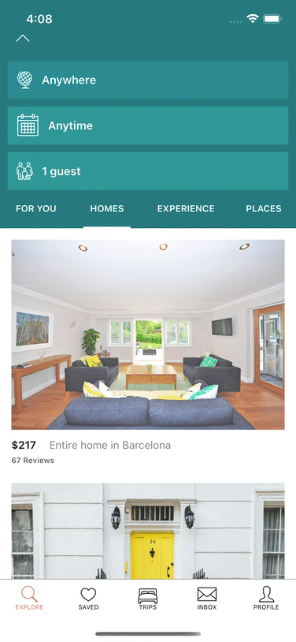

This sample application show's Contextual SDK for both no-code and low code use-cases.

# No Code

1. Create an account at [Contextual Dashboard](https://dashboard.contextu.al/ "Contextual Dashboard").
2. Install the Contextual SDK following the instructions for IOS or Android.
3. Follow this [video]( https://player.vimeo.com/video/733886063?h=c799c48907&amp;badge=0&amp;autopause=0&amp;player_id=0&amp;app_id=58479  "Guide Creation How-to") for more step-by-step guide creation.

# Extensibility (Low Code)

Like something Contextual doesn’t offer in our Standard Components? Contextual provide a powerful capability to use your favourite open source components or even your own in-App elements as part of Guides. We call these "GuideBlocks".

## Fancy Announcement

In this example, we show how to make a Fancy Announcement, just like the crazy ones your Designer comes up with 🤣. Its a simple example to get you started with Contextual Extensibility without needing to hard-code your changes every time you want to update the tip.

To use in your App, [follow the instruction at](https://github.com/GuideBlocks-org/iOS-GuideBlocks/blob/confetti/Sources/iOS-GuideBlocks/FancyAnnouncement/README.md)

 

## List Row Insertion

The Apps' existing code can be now orchestrated for Product Team to make use of. This powerful but simple example shows how you can add engagement for promotional content in existing app lists without cluttering screen realestate. Do engagemet just like Twitter or Facebook does and no need for Appstore releases! (after the initial low code work is done)

This example illustrates how you can extend your existing lists with engagement messaging, inline. Your App developer can add this and with a few lines of code extend your application so that a new row can be targeted to specific users with promotional or explanatory content entered from the Contextual Dashboard - no code!

This row example is based on a standard Contextual Announcement template. The steps are:
1. Create an account at [Contextual Dashboard](https://dashboard.contextu.al/ "Contextual Dashboard").
2. Install the Contextual SDK following the instructions for IOS or Android.
3. Your developer:
 *  adds your existing row content creation to this source code example.
 * Add the sample wrapper code for example, *AdhocRowInsertion*
4. In the Dashboard, create or edit a Guide.
5. Choose an Announcement Template that best shows the design of a row in your app. For example, do you have Titles, Content, Pictures.
6. Copy-Paste the instantiation of the Guide Component AFTER the Contextual SDK registration. 
 * Now go to the Extensibility section in the sidebar and paste in the JSON as follows:

 `
 {
  "guideBlockKey": "AdhocRowInsertion",
  "position": 1,
  "cellID": "customCellID",
  "rowHeight": 300,
  "name": "Feature"
}
`

7. In the sidebar under the relevent sections: Edit the title, content, image location (upload images etc)
8. Save the guide and show to your Product Team, once you release this version of the App they can launch List Row Insertion to whoever they want, whenever they want.

 

 ## Multiple Choice Survey 

This is a terrific example about how complex or very custom use-cases can be deployed and easily used by your Product Team. Its the best of Code and No-code combined! Extend your Apps capabilities once, THEN

* launch once, twice, many times 
* to specific users and
* measure results.

1. Create an account at [Contextual Dashboard](https://dashboard.contextu.al/ "Contextual Dashboard").
2. Repeat the steps 1-5 above. In the code for the wrapper make it's name *MultipleChoiceCustom*

`
{
  "guideBlockKey": "MultipleChoiceCustom"
}
`

3.  In the sidebar under the relevent sections:
 * Edit the title, content
 * Change the Question and the Answer options
4. Save the guide and show to your Product Team, once you release this version of the App they can launch Multiple Choice Survey to whoever they want, whenever they want.

## Multiple Choice Survey as a List Row Insertion
Another example is a combination of the survey and a List Row insertion. Try it out, it should/could look like this:

